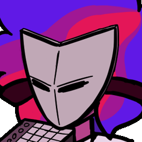

# About

Heya! I'm Teo, or as I go by online, Neo (very distinct names I know). I'm a 4th year computer science student at Heriot-Watt University and I love music, art, and coding!

I love coding in various programming languages, and I have a particular interested in computer graphics and lower-level stuff. Right now I'm working on and off of several personal projects, if you'd like to check them out, [check out my GitHub](https://github.com/teojt){:target="_blank"}{:rel="noopener noreferrer"}
or check out my [blog]({{ site.baseurl }}).

## Contact
Email: tjt2000 (at) hw.ac.uk

Or, just fire me a friend request:
Discord- neo_2222

